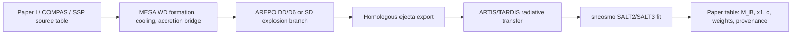

# AREPO SN Ia Development Plan

<span style="color:red"><b>Paper rule:</b> no physical result from this branch is publishable until the EOS, burning model, detonation criterion, resolution study, and RT conversion are validated against cited tests.</span>

## What Was Actually Run

There are now three AREPO SN Ia development smoke configurations:

```text
./scripts/run_arepo_snia_dev_smoke.sh
./scripts/run_arepo_snia_dev_smoke.sh --branch dd-d6
./scripts/run_arepo_snia_dev_smoke.sh --branch sd-ddt
```

They build:

```text
external_codes/arepo-public/ArepoSNIaDev
external_codes/arepo-public/ArepoSNIaDDD6Dev
external_codes/arepo-public/ArepoSNIaSDDDTDev
```

from:

```text
configs/arepo_snia_development_config.sh
configs/arepo_snia_dd_d6_development_config.sh
configs/arepo_snia_sd_ddt_development_config.sh
```

Each run currently uses the same 1D shock-tube wiring IC with eight isotope-like passive scalars. This verifies:

- the public AREPO checkout still builds after SN Ia hooks are added;
- `SNIA_NETWORK`, branch flags, detonation/flame/turbulence/DDT/tracer modules compile cleanly;
- the end-of-step source-term hook is called;
- snapshots write `PassiveScalars`;
- a hydro-to-RT neutral ejecta summary/table can be exported.

It does not yet perform nuclear energy release, detonation, WD self-gravity, turbulent deflagration, DDT, or physical SN Ia ejecta.

There is also a first DD/D6 3D binary pre-explosion scaffold:

```text
./scripts/run_arepo_dd_d6_binary_stage.sh --stage relaxation
```

It builds `external_codes/arepo-public/ArepoSNIaDDD6BinaryDev`, creates a
two-WD HDF5 IC from a source-table row, evolves it with self-gravity, writes
AREPO snapshots, and exports hotspot/composition diagnostics. This verifies the
binary snapshot/diagnostic workflow, not the physical validity of the pilot WD
structure.

## Current Code Hooks

Patched public AREPO files:

- `external_codes/arepo-public/Template-Config.sh`
  - registers `SNIA_NETWORK`, DD/D6/sub-Chandra flags, SD-DDT flags, `SNIA_DETONATION_TRIGGER`, `SNIA_FLAME_MODEL`, `SNIA_TURBULENCE_DIAGNOSTICS`, `SNIA_DDT_CRITERION`, and `SNIA_TRACER_EXPORT`.
- `external_codes/arepo-public/Makefile`
  - compiles the `src/snia/` modules when `SNIA_NETWORK` is active.
- `external_codes/arepo-public/src/init/begrun.c`
  - calls `snia_network_init()`.
- `external_codes/arepo-public/src/main/run.c`
  - calls `snia_network_end_of_step()` from `calculate_non_standard_physics_end_of_step()`.
- `external_codes/arepo-public/src/snia/snia.h`
- `external_codes/arepo-public/src/snia/snia_network.c`
- `external_codes/arepo-public/src/snia/snia_diagnostics.c`
- `external_codes/arepo-public/src/snia/snia_detonation.c`
- `external_codes/arepo-public/src/snia/snia_flame.c`
- `external_codes/arepo-public/src/snia/snia_turbulence.c`
- `external_codes/arepo-public/src/snia/snia_ddt.c`
- `external_codes/arepo-public/src/snia/snia_tracer.c`

SNIA_Sim support files:

- `configs/arepo_snia_development_config.sh`
- `configs/arepo_snia_dd_d6_development_config.sh`
- `configs/arepo_snia_sd_ddt_development_config.sh`
- `scripts/create_arepo_snia_dev_ic.py`
- `scripts/run_arepo_snia_dev_smoke.sh`
- `scripts/plot_arepo_snia_dev_snapshot.py`
- `scripts/arepo_snapshot_to_ejecta_table.py`
- `scripts/create_arepo_dd_d6_binary_ic.py`
- `scripts/run_arepo_dd_d6_binary_stage.sh`
- `scripts/diagnose_arepo_dd_d6_preexplosion.py`
- `scripts/plot_arepo_dd_d6_binary_snapshot.py`
- `scripts/plot_arepo_dd_d6_binary_sequence.py`

Current branch diagnostic outputs:

- `production_runs/arepo_snia_dd_d6_dev_smoke/output/snia_manifest.txt`
- `production_runs/arepo_snia_dd_d6_dev_smoke/output/snia_detonation_diagnostics.txt`
- `production_runs/arepo_snia_sd_ddt_dev_smoke/output/snia_manifest.txt`
- `production_runs/arepo_snia_sd_ddt_dev_smoke/output/snia_flame_diagnostics.txt`
- `production_runs/arepo_snia_sd_ddt_dev_smoke/output/snia_turbulence_diagnostics.txt`
- `production_runs/arepo_snia_sd_ddt_dev_smoke/output/snia_ddt_diagnostics.txt`

Current branch visualizations:

- `results/visualizations/arepo_snia_dd_d6_dev_smoke.png`
- `results/visualizations/arepo_snia_sd_ddt_dev_smoke.png`
- `results/visualizations/arepo_dd_d6_binary_pilot_ic.png`
- `results/visualizations/arepo_dd_d6_binary_pilot_relaxation_snap010.png`
- `results/visualizations/arepo_dd_d6_binary_both_mesa_profile_pilot_relaxation_frames/snap_000.png`
- `results/visualizations/arepo_dd_d6_binary_both_mesa_profile_pilot_relaxation_frames/snap_010.png`

## End-to-End Target Flow



## Phase A: Infrastructure Already Started

Goal: make AREPO carry SN Ia state without changing physics.

Done:

- compile-time SN Ia module flags;
- source-term hook at the end of hydro steps;
- passive scalar isotope-like ICs;
- HDF5 snapshot scalar output;
- diagnostic visualization;
- ejecta summary/table exporter.

Next required checks:

- passive-scalar conservation test over multiple snapshots;
- scalar remap/refinement test once moving/refining 3D meshes are enabled;
- unit metadata in every snapshot/export.

## Phase B: EOS

Production SN Ia calculations cannot use the ideal-gas smoke EOS. Add a Helmholtz-style EOS with ions, radiation, and degenerate electron/positron contribution, following Timmes & Swesty 2000.

Implementation tasks:

1. Add `src/snia/snia_eos.[ch]`.
2. Define a primitive-state wrapper: density, specific internal energy, composition -> temperature, pressure, sound speed.
3. Add robust inversion from internal energy to temperature.
4. Add a standalone one-zone EOS test program or script-driven table comparison.
5. Gate physical burning behind `SNIA_HELMHOLTZ_EOS`; keep smoke tests ideal-gas only.

Acceptance tests:

- pressure and temperature agree with tabulated/known Helmholtz references over WD density-temperature ranges;
- no negative pressure/temperature in hydrodynamic update;
- sound speed is stable enough for timestep control.

## Phase C: Burning Model

Use a two-layer strategy:

1. Hydro energy release: reduced alpha-chain or calibrated tabulated burning.
2. Final isotopic yields: tracer post-processing with a larger network.

Recommended first hydro network:

- fuel: He4, C12, O16;
- products/proxies: Si28, Ca40, Ti/Cr proxy, stable IGE, Ni56;
- conserve scalar mass fractions;
- update thermal energy with a burn limiter and subcycling.

Implementation tasks:

1. Replace the no-op `snia_network_end_of_step()` with active-cell iteration.
2. Add `snia_burn_cell()` that takes density, temperature, internal energy, and scalar fractions.
3. Add burn subcycling so nuclear timescale cannot outrun hydro timestep.
4. Add timestep limiter based on fractional energy/composition change.
5. Record per-step global diagnostics: burned mass, Ni56 proxy mass, total nuclear energy, failed cells.

Acceptance tests:

- one-zone burn: monotonic energy release and scalar conservation;
- planar detonation: speed and ash state compared to published benchmarks;
- hydro+network conservation: total mass and scalar sums stable outside burning zones.

## Phase D: Detonation Trigger

For DD/D6 first, use a cited, auditable trigger rather than arbitrary thresholds.

Trigger metadata per event:

- channel: DD, D6, SD-DDT;
- composition class: He shell or C/O core;
- density, temperature, cell size, hotspot radius/proxy;
- local fuel mass fraction;
- resolution level and neighbor count;
- reference criterion used;
- whether trigger is imposed or self-consistent.

Implementation tasks:

1. Add `src/snia/snia_detonation.[ch]`.
2. Start with diagnostics-only hotspot search.
3. Add an imposed detonation mode for reproducing published models, explicitly labelled.
4. Add edge-lit D6 trigger logic after helium-shell structures are mapped from MESA.
5. Later add SD DDT logic only after a deflagration model and turbulence diagnostic exist.

Acceptance tests:

- no detonation in cold WD controls;
- trigger appears only in physically tagged fuel;
- trigger location and time are reproducible across restart;
- resolution study demonstrates convergence or quantifies non-convergence.

## Phase E: Tracers and RT Export

Passive scalars are enough for smoke tests and low-order RT scaffolding. Publication yields need tracer histories.

Implementation tasks:

1. Keep `PassiveScalars` for hydro-coupled energy/composition.
2. Add Monte Carlo tracer particles or cell-history sampling.
3. Export tracer histories: time, density, temperature, composition, cell id.
4. Export homologous ejecta: position, velocity, density, mass, isotope fractions, time.
5. Convert ejecta to ARTIS/TARDIS model formats.

Existing bridge:

```text
scripts/arepo_snapshot_to_ejecta_table.py
```

This already writes a code-neutral summary JSON and cell CSV from AREPO snapshots.

Acceptance tests:

- ejecta mass, Ni56 mass, kinetic energy match hydro diagnostics;
- velocity field is close to homologous before RT conversion;
- RT input preserves total mass and isotope masses after binning.

## Phase E2: DD/D6 3D Binary Stage

This is the correct first AREPO target because DD/D6 mass transfer and merger
become genuinely dynamical near contact. AREPO is useful here for moving-mesh
self-gravity, angular-momentum tracking, stream impact, and asymmetric ejecta
geometry.

Current workflow:

```text
source table row -> analytic or MESA-mapped binary IC -> AREPO relaxation
-> merger/pre-explosion snapshots -> hotspot diagnostics -> detonation branch
```

Implemented now:

- HDF5 two-WD IC creation with component labels and eight passive composition
  channels;
- Roche-contact analytic bootstrap for pilot rows only;
- optional MESA `profile*.data` mapping for primary/secondary WD radial
  structure, composition, and temperature provenance;
- self-gravity relaxation run through `ArepoSNIaDDD6BinaryDev`;
- snapshot figures and hotspot candidate tables.

Required before science:

1. Replace analytic bootstrap structures with MESA/WDEC WD density, temperature,
   and composition profiles.
2. Add relaxation damping and verify virial equilibrium, angular momentum, and
   mass conservation.
3. Run a resolution sequence, not one 4096-cell pilot.
4. Add Helmholtz EOS and cited detonation criteria before allowing ignition.
5. Export homologous ejecta only after the explosion branch is physically active.

Current profile-mapping caveats:

- the existing tested run maps only the primary WD from
  `production_runs/mesa_dd_wd_he_shell_ignition/LOGS/profile6.data`;
- the pilot source row has `M_primary=1.05 Msun`, while that MESA profile has
  `M=0.9589008445 Msun`, so the mapping is explicitly mass-rescaled and
  labelled non-publication;
- MESA temperatures are currently converted to AREPO internal energy through an
  ideal-ion placeholder, not a degenerate Helmholtz EOS;
- MESA composition residuals such as Ne20 are recorded as unmapped residual
  mass until the hydro scalar set is expanded.

## Phase F: Observables

AREPO does not output `M_B`, `x1`, or `c`. These are obtained after RT and light-curve fitting.

Implementation tasks:

1. Run ARTIS/TARDIS on homologous ejecta.
2. Generate synthetic multi-band photometry with fixed filters/cadence.
3. Fit with `sncosmo` SALT2/SALT3.
4. Save per-case:
   - `M_B`;
   - `x1`;
   - `c`;
   - fit covariance and chi-square;
   - viewing angle if 3D;
   - source progenitor row and hydro/RT code version.

## Recommended Paper-II Development Order

1. Source table: user-provided weighted progenitors from Paper I/COMPAS/SSP, stored as `data/paper2/progenitor_grid.csv`.
2. MESA bridge: WD state, cooling/accretion provenance, figures.
3. AREPO D6/DD smoke-to-physics branch:
   - passive scalar conservation;
   - EOS;
   - one-zone burn;
   - planar detonation;
   - WD detonation benchmark.
4. RT bridge:
   - ejecta export;
   - ARTIS/TARDIS pilot light curve;
   - SALT fit with `sncosmo`.
5. Keep the SD Chandrasekhar DDT scaffold compiling from now on, but only activate physical SD burning after the ADR/level-set flame, turbulence model, and DDT criterion pass their own tests.

## Why SD Is Split Differently From DD/D6

SD is not forbidden in AREPO. The problem is the secular accretion phase. Stable
or recurrent accretion toward a Chandrasekhar-mass WD evolves over
`10^5-10^7 yr`, while the Courant timestep for a WD surface or binary stream is
seconds to minutes. A full 3D compressible AREPO calculation across that entire
history would spend almost all of its cost integrating a quasi-static stellar
evolution problem.

For SD, the scientifically consistent split is:

```text
COMPAS/Paper I/SSP -> MESA binary/accretion/cooling/simmering state
-> 3D hydro only for near-ignition convection/flame/explosion or
   ejecta-companion interaction
-> RT -> SALT observables
```

For DD/D6, the late binary interaction is itself dynamical:

```text
COMPAS/Paper I/SSP -> MESA WD structures/cooling
-> AREPO contact, stream impact, merger, He-shell/core detonation branch
-> RT -> SALT observables
```

These channels can be combined in one population catalogue if every row carries
its channel label, source weight, delay time, metallicity, WD structure
provenance, hydro code/branch, RT code, SALT fitter version, and modelling
systematics. The catalogue-level observable contract is common even when the
best hydro tool differs by channel.

## Why AREPO Was Not Previously a Full SN Ia Run

Because the installed public AREPO code is a hydrodynamics framework, not a ready SN Ia explosion code. It lacked:

- a degenerate WD EOS;
- nuclear burning/source terms;
- deflagration/DDT/detonation trigger logic;
- isotope yield tracking beyond generic passive scalars;
- tracer post-processing;
- RT-format ejecta export.

The new scaffold starts filling those gaps in the correct order while keeping the distinction between "wiring test" and "physical result" explicit.
